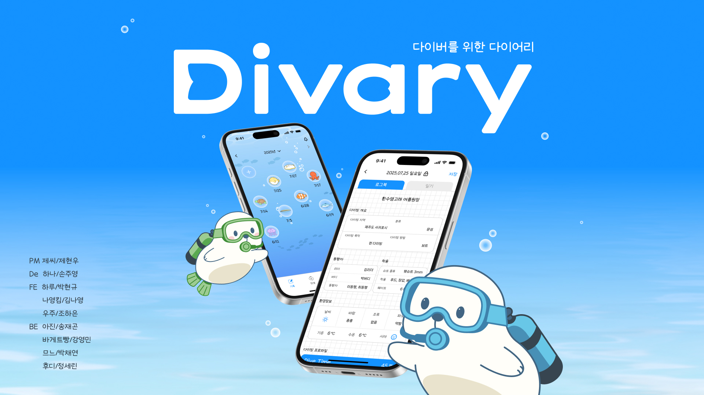

# Portfolio



## 🌊 다이버리 (Divary)

**"바다를 기록하고, 추억을 꾸미다"**

스쿠버다이빙을 사랑하는 사람들을 위한 감성 다이빙 로그 앱

### 기술 스택
- **Backend**: Spring Boot, MySQL
- **Frontend**: iOS (UIKit), SwiftUI
- **API**: GPT API, 날씨/수온 API
- **기타**: Canvas API / PencilKit

### 주요 기능
- 📘 다이빙 로그 (날짜, 장소, 수심, 수온 등 기록)
- 📓 다이빙 일기장 (사진, 스티커로 꾸미기)
- 🐠 해양 도감 (GPT 연동 AI 생물 인식)
- 🌊 나의 바다 & 아바타 (커스터마이징)

---

## 🚀 프로젝트 구성

### 기술 스택
- **Frontend**: React, Vite
- **Styling**: CSS3, Responsive Design
- **Deployment**: GitHub Pages
- **Tools**: Git, npm

### 주요 기능
- 🖥️ macOS 스타일 데스크톱 UI
- 📁 인터랙티브 폴더/앱 시스템
- 🎨 Finder 스타일 포트폴리오 브라우저
- 💻 VS Code 스타일 프로젝트 뷰어
- 🐙 GitHub 통합 (Contribution Graph, Repositories)
- ✉️ 이메일 앱
- 📝 Velog 연동

---

## 📦 설치 및 실행

```bash
# 의존성 설치
npm install

# 개발 서버 실행
npm run dev

# 빌드
npm run build

# 배포
npm run deploy
```

---

## 🌐 배포

GitHub Pages를 통해 배포됩니다.

**Live Demo**: [https://worhs02.github.io/portfolio-dev/](https://worhs02.github.io/portfolio-dev/)

---

## 📂 프로젝트 구조

```
portfolio-dev/
├── public/
│   ├── images/          # 이미지 파일
│   └── github-data.json # GitHub 데이터 (자동 생성)
├── src/
│   ├── components/      # React 컴포넌트
│   ├── data/           # 프로젝트 데이터
│   └── styles/         # CSS 파일
└── .github/
    └── workflows/      # GitHub Actions
```

---

## 👨‍💻 개발자

**송재곤 (worhs02)**

- GitHub: [@worhs02](https://github.com/worhs02)
- Email: worhs02@gmail.com